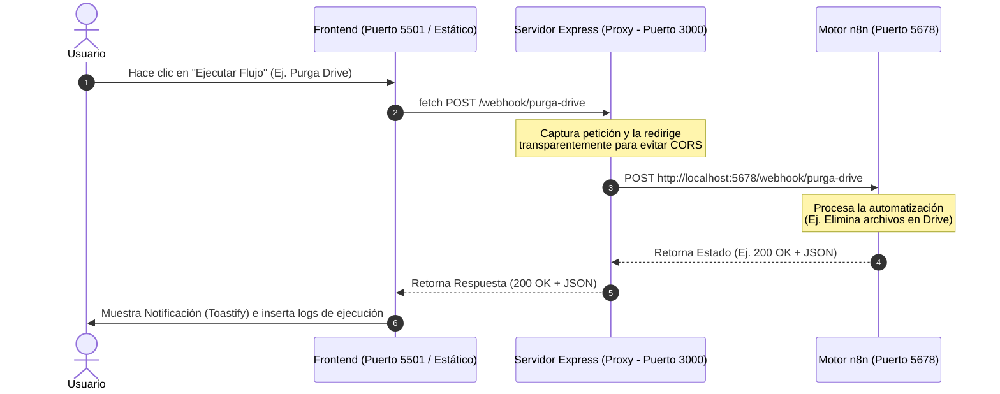

# 📊 n8n Webhook Controller Panel (n8n-webhook-panel)

[](https://nodejs.org/)
[](https://expressjs.com/)
[](https://n8n.io/)
[](LICENSE)

Un panel de control local (Dashboard) visualmente atractivo, intuitivo y moderno diseñado para disparar y gestionar flujos de automatización (workflows) construidos en la plataforma **n8n** sin necesidad de entrar a la interfaz de desarrollo de n8n.

---

## 🎯 Objetivo del Proyecto

El objetivo principal de **n8n-webhook-panel** es proporcionar una interfaz simplificada para que usuarios o administradores ejecuten procesos automatizados bajo demanda (como la *"Purga de Drive"* o *"Generación de Newsletter con IA"*) y prueben webhooks personalizados de forma ágil, facilitando además la visualización en tiempo real de los registros de ejecución (Logs) y el estado de cada tarea.

---

## 🏗️ Arquitectura y Flujo de Comunicación

El proyecto está diseñado bajo una arquitectura de **Cliente-Servidor ligera (Monolítica Front-Back local)** orientada a microservicios proxy. Esto resuelve los problemas de políticas de origen cruzado (CORS) que ocurren cuando el navegador intenta realizar peticiones HTTP directas a n8n.

### Diagrama de Flujo (Proxy Inverso)



---

## 🛠️ Tecnologías y Librerías Utilizadas

### 1. Frontend (Capa de Presentación)
* **HTML5 & CSS3 Moderno:** Maquetación estructurada y responsive.
* **Diseño Glassmorphism:** Interfaz elegante con efectos estéticos de desenfoque, transparencias, gradientes modernos y soporte dinámico para modo **Claro / Oscuro**.
* **Vanilla JavaScript:** Control de interfaz de usuario, manejo del API `fetch` para llamadas asíncronas y manipulación del DOM en tiempo real.
* **Librerías externas:**
  * **Inter (Google Fonts):** Tipografía de alta legibilidad.
  * **FontAwesome:** Iconos vectoriales premium para controles y estados.
  * **Toastify.js:** Notificaciones emergentes, fluidas y no intrusivas para indicar el éxito o fallo de los procesos.
  * **LocalStorage:** Persistencia en el navegador para recordar la preferencia del tema visual seleccionado.

### 2. Backend (Capa Middleware y Despacho)
* **Node.js & Express.js:** Motor de servidor local ligero y rápido.
* **CORS (Middleware):** Control y configuración segura de accesos entre orígenes cruzados.
* **http-proxy-middleware:** Solución robusta para enrutar transparentemente peticiones HTTP del frontend hacia la API de n8n, resolviendo el bloqueo de CORS.

---

## 📂 Estructura del Proyecto

```text
n8n-webhook-panel/
├── backups/               # Respaldos de archivos clave (ignorado en Git)
├── docs/                  # Documentación del proyecto
│   └── informe_tecnico.md # Informe técnico detallado de arquitectura
├── index.html             # Interfaz web principal (Frontend Dashboard)
├── mini-server-n8n.js     # Servidor local Node.js / Express (Proxy Backend)
├── package.json           # Dependencias y scripts del proyecto
├── README.md              # Documentación de inicio (Este archivo)
└── .gitignore             # Configuración de exclusión para control de versiones
```

---

## 🚀 Instalación y Puesta en Marcha

Sigue estos sencillos pasos para instalar y ejecutar el panel de control localmente:

### 1. Requisitos Previos
Asegúrate de tener instalados en tu sistema:
* [Node.js](https://nodejs.org/) (Versión 18 o superior recomendada)
* [n8n](https://n8n.io/) ejecutándose localmente (por defecto en el puerto `5678`)

### 2. Clonar e Instalar Dependencias
Abre tu terminal y ejecuta:
```bash
# Clonar este repositorio (o descargar los archivos)
cd n8n-webhook-panel

# Instalar dependencias del servidor
npm install
```

### 3. Iniciar el Servidor de Control
Ejecuta el siguiente comando para levantar el servidor backend de Express:
```bash
npm start
```
Esto iniciará el servidor local, que escuchará peticiones y servirá la interfaz del Dashboard.

### 4. Ejecución
1. Abre tu navegador preferido e ingresa a: `http://localhost:3000` (o la dirección que muestre tu terminal).
2. Asegúrate de tener tu servidor local de **n8n** encendido (`n8n start`) y con los correspondientes Webhook triggers activos y configurados para escuchar las peticiones de este panel.
3. ¡Haz clic en los botones de acción del Dashboard para iniciar tus automatizaciones y observa las notificaciones e historial de logs en tiempo real!

---

## 💡 Conclusión
Esta arquitectura desacoplada y ligera representa una excelente solución para administrar flujos operativos complejos en n8n de manera sencilla. Al encapsular la lógica del flujo de datos tras un servidor Express local que hace de proxy, se dota al proyecto de robustez técnica, simplicidad y escalabilidad para usuarios de cualquier nivel técnico.
